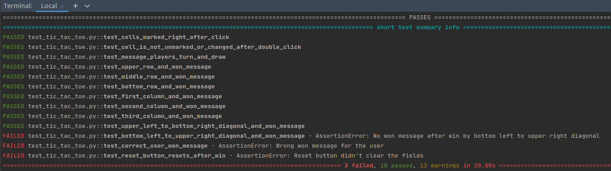

# Artem Kravchenko Challenge Results and Tests
*Tech part below*.
## The found bugs
First the bugs. I have a big experience in creating bug reports. I'm aware of all the attributes of the bug and used different bug tracking systems. 
But here I will write a short description not to overload you with reading.

**Bug 1:** Clicking "Restart Game" button shows an error message and doesn't restart the game.

**Bug 2:** Win of "O" player shows a message about the victory of "X" player and vice versa.

**Bug 3:** Filling the diagonal from upper right corner to the left bottom corner doesn't give victory to the player and doesn't stop the game.

**Bug 4:** Clicking upper right corner, center and middle bottom cells gives win.

The last bug was found manually but could be found with automatically clicking all the possible combinations.

**Additional comments after looking in the code:**

The **numberOfMoves** is not updated and is always 0. Function **handleRestartGame** has an if statement with **return** keyword which skips further logic.

Function **handleRestartGame** has check for **numberOfMoves** == 5 which is never reached. If **numberOfMoves** were being updated properly it could lead to a corner case bug of not **reset** not working when 4 moves made.

**Implemented testcases:**

All cases could be automated for both x and y in case of Black Box testing. But as I see from code there is no need in that.

Every cell marked when clicked.

Clicking same cell more than once, assert value is not changed.

Check upper row win by x.

Check middle row win by y.

Check lower row win by x.

Check upper left to bottom right diagonal win by x.

Check bottom left to upper right diagonal win by y.

Check Reset button resets. May be extended by after win, after draw, in the middle.

Check message after win. May be extended by after every win combination for every player.

Check message after draw.

Check whose turn message.

## Tech part:

Too small page to make a big framework with **BaseTest** class and **Page Object** pattern. And for using **BDD** (given, when, then). Also no need in web-server and **CI/CD** tools. One I worked most with was **Jenkins**.

I used **Python** + **PyTest** + **Selenium Webdriver** and **Chrome Webdriver** for this small suite. I also know how to automate in **Cypress** + **JavaScript** if needed and also **Java** + **TestNG** + **Selenium**. Also I have experience in automation for **Firefox** and a bit for **Safari**.

To launch the tests you'll need **Python 3** to be installed.

While in the root directory of the project input in CLI the `pip install -r requirements.txt` command to install all the modules and packages listed in the **requirements.txt** file. 

**Python 3.4+** comes with **pip** already installed. If no, please run `python -m pip install --upgrade pip` before installing requirements.

After all requirements are installed you can launch the tests. Input `cd tests` to go to the test directory. Input `pytest -r A` to launch the tests. After tests run you will see list of all tests like at the picture below. The failed tests show the error messages for the asserts.
Code itself is in **test_tic_tac_toe.py** file inside **tests** folder.
